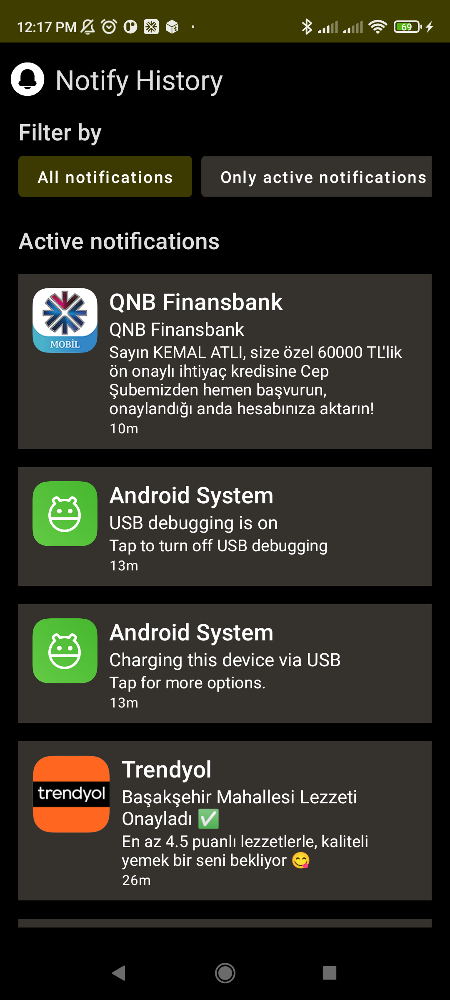

# Notify History

Notify History is an android app that lists received notifications with filtering capabilities.

## Screenshots

  
   
  

  
   
  
  

## App Overview

This app attempts to use latest libraries and tools to achieve showing received notifications. To be
able to fetch the notifications, app makes use of notification listener service with required
permissions such as battery optimizations and app auto-start.

The app uses room database to persist information as caching layer so that it can also be used as
historical log for notifications. That's also te reason why local cache is introduced as single
source of truth throughout the app.

Libraries used:

* Entirely written in Kotlin
* UI completely written in Jetpack Compose
* Uses Kotlin Coroutines
* Uses many of the Architecture Components, including: Room and Lifecycle components.
* Uses Dagger Hilt for dependency injection
* Checks notification listener permissions
* Checks battery optimization restrictions
* Checks auto-start capabilities